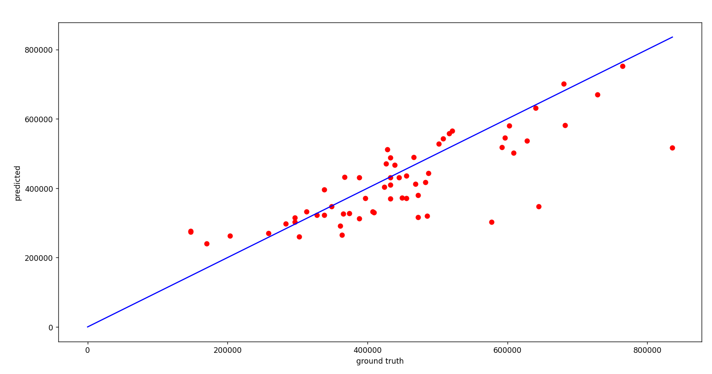
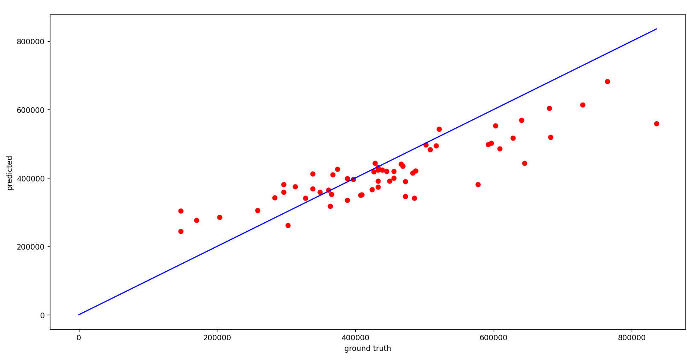

# 房价预测

## 1 问题描述

房屋价格和所在区域、楼层、房龄等都有密切的关系，现在需求开发一个房价预测的模型，通过训练数据拟合得到房屋的价格

将所给的`housing.csv`数据划分成训练集与测试集，使用自选的方法构建一个回归模型，利用训练好的模型预测测试集数据的房价，并和真值比较，计算误差。要求：

- 编写回归模型的训练、测试程序。
- 简述数据集划分过程。
- 详细解释数据集所使用的方法。
- 利用训练好的模型将测试集的数据进行预测，和真值进行对比，计算平均误差。
- 分析模型的问题。


## 2 数据预处理

| RM    | LSTAT | PTRATIO | MEDV   |
| ----- | ----- | ------- | ------ |
| 6.575 | 4.98  | 15.3    | 504000 |
| 6.421 | 9.14  | 17.8    | 453600 |
| 7.185 | 4.03  | 17.8    | 728700 |
| 6.998 | 2.94  | 18.7    | 701400 |
| 7.147 | 5.33  | 18.7    | 760200 |

上表为`housing.csv`中的部分数据。其中`MEDV`为房价，其他三列是影响房价的因素。

观察数据可以发现，`RM`，`LSTAT`和`PTRATIO`的scale不同，于是要对数据做归一化处理。归一化的常见方法有线性归一化和零均值归一化。其中，如果数据的实际分布不符合正态分布，零均值归一化的效果会变差。

在做标准化之前，要得到数据集中的一些统计量。例如零均值标准化就需要知道数据的均值和方差。但考虑到通常验证集和测试集上的数据量较少，它们的均值与方差会直接使用训练集的。由于拿到的数据集只有一张总表，于是首先要划分数据集。


### 2.1 数据集划分

`housing.csv`中共有489条数据。按照$8:1:1$的分配规则将其随机划分为训练集、验证集和测试集。关键代码如下。

```python
def data_spliter(raw_data):
    train_set = []
    dev_set = []
    test_set = []
    for data in raw_data:
        rand = random.random()	# 介于(0, 1)的随机数
        if rand < 0.8:  # 训练集
            train_set.append(data)
        elif 0.8 <= rand < 0.9:  # 验证集
            dev_set.append(data)
        else:  # 测试集
            test_set.append(data)

    return train_set, dev_set, test_set
```


### 2.2 归一化

本实验中使用的是零均值标准化。在创建训练集的`data_loader`时同时要计算数据集的均值和方差，并对数据做标准化。对于验证集和测试集，则使用训练集的均值和方差做标准化。关键代码如下。

另外，由于房价数字太大，为了方便之后模型收敛，对其取了对数。在预测时，则取指数。

```python
class HousingDataset(torch.utils.data.Dataset):
    def __init__(self,
                 path,
                 mode='train',
                 mean=0,
                 std=1):

        self.mode = mode
        self.mean = mean
        self.std = std

        with open(path, 'r') as fp:
            data = list(csv.reader(fp))
            data = np.array(data[1:]).astype(float)

        # 测试
        if mode == 'test':
            data = data[:, :-1]
            self.data = torch.FloatTensor(data)
        # 训练
        else:
            target = data[:, -1]
            data = data[:, :-1]

            # 将训练数据进一步划分为训练集和验证集
            if mode == 'train':
                self.data = torch.FloatTensor(data)
                self.target = torch.log(torch.FloatTensor(target))

                self.mean = self.data.mean(dim=0, keepdim=True)
                self.std = self.data.std(dim=0, keepdim=True)
            elif mode == 'dev':
                self.data = torch.FloatTensor(data)
                self.target = torch.log(torch.FloatTensor(target))
            else:
                raise Exception('Unknown mode!')

        # 数据归一化
        self.data = (self.data - self.mean) / self.std

    def get_stats(self):
        return self.mean, self.std

    def __getitem__(self, index):
        if self.mode in ['train', 'dev']:
            return self.data[index], self.target[index]
        else:
            return self.data[index]  # 没有target

    def __len__(self):
        return len(self.data)
```


## 3 模型构建

模型包括两个线形层和一个`ReLU()`激活函数层，代码如下。

```python
class Predictor(nn.Module):
    def __init__(self, input_dim):
        super(Predictor, self).__init__()

        self.net = nn.Sequential(
            nn.Linear(input_dim, 64),
            nn.ReLU(),
            nn.Linear(64, 1)
        )

    def forward(self, x):
        return self.net(x).squeeze(1)
```


## 4 训练

训练中使用的损失函数是MSE loss，主要代码如下。

```python
def main(config_path):
    if not os.path.exists('experiments'):
        os.makedirs('experiments')

    config = get_hparams_from_file(config_path)
    device = torch.device('cuda:0' if torch.cuda.is_available() else 'cpu')
    torch.manual_seed(config.train.seed)

    train_loader, mean, std = build_dataloader(path=config.data.train_path,
                                               mode='train',
                                               batch_size=config.train.batch_size,
                                               device=device)

    dev_loader, _, _ = build_dataloader(path=config.data.dev_path,
                                        mode='dev',
                                        mean=mean,
                                        std=std,
                                        batch_size=config.train.batch_size,
                                        device=device)

    predictor, optimizer = build_model(config)
    predictor.to(device)

    predictor.train()

    epoch = 0
    global_step = 0
    early_stop_count = 0

    loss_record = {'train': [], 'dev': []}
    min_mse = 1000

    criterion = nn.MSELoss(reduction='mean')

    while epoch < config.train.epochs:
        counter = 0
        for x, y in train_loader:
            optimizer.zero_grad()
            x, y = x.to(device), y.to(device)
            pred = predictor(x)
            mse_loss = criterion(pred, y)
            mse_loss.backward()
            optimizer.step()

            loss_record['train'].append(mse_loss.detach().cpu().item())

            global_step += 1
            counter += 1

            if global_step % config.train.log_interval == 0:
                progress = counter / len(train_loader) * 100
                log = 'Epoch [{}/{}]: {:.2f}%, step {}, MSE loss: {:.4f}'. \
                    format(epoch, config.train.epochs, progress, global_step, mse_loss)
                print(log)

        predictor.eval()
        total_loss = 0.0
        for x, y in dev_loader:
            x, y = x.to(device), y.to(device)
            with torch.no_grad():
                pred = predictor(x)
                mse_loss = criterion(pred, y)
            total_loss += mse_loss.detach().cpu().item() * len(x)
        total_loss = total_loss / len(dev_loader.dataset)  # 平均loss
        loss_record['dev'].append(total_loss)

        log = 'Validation at epoch {}, MSE loss: {}'.format(epoch, total_loss)
        print(log)

        if total_loss < min_mse:
            min_mse = total_loss
            save_checkpoint(config.train.save_path, predictor, optimizer, config.train.learning_rate, epoch)
            early_stop_count = 0
        else:
            early_stop_count += 1

        if early_stop_count > config.train.early_stop_count:
            break

        epoch += 1

    print('Finished training after {} epochs'.format(epoch))

    train_loss = np.array(loss_record['train'])
    dev_loss = np.array(loss_record['dev'])

    np.save('experiments/train_loss.npy', train_loss)
    np.save('experiments/dev_loss.npy', dev_loss)
```


## 5 推理

如前述，训练时对房价取了对数，则推理时要取指数。另外测试集也要做归一化，使用的统计量来自训练集。推理的主要代码如下。

```python
def inference(config_path, checkpoint_path, save_path, stats):
    device = torch.device('cuda:0' if torch.cuda.is_available() else 'cpu')
    config = get_hparams_from_file(config_path)

    mean, std = stats

    test_loader, _, _ = build_dataloader(path=config.data.test_path,
                                         mode='test',
                                         mean=mean,
                                         std=std,
                                         batch_size=1,
                                         device=device)

    predictor = Predictor(input_dim=config.model.input_dim)
    predictor, _, _, _ = load_checkpoint(checkpoint_path, predictor)
    predictor.eval()

    preds = []

    for x in test_loader:
        x = x.to(device)
        with torch.no_grad():
            pred = predictor(x)
            pred = torch.exp(pred)  # 训练时取了log
            preds.append(pred)

    preds = torch.cat(preds, dim=0).numpy()

    save_result(preds, save_path)
```


## 6 实验

### 6.1 超参数设置

```python
{
  "train": {
    "log_interval": 500,	
    "eval_interval": 500,	
    "seed": 1234,	
    "epochs": 100,
    "betas": [0.8, 0.99],
    "eps": 1e-9,
    "learning_rate": 1e-3,
    "lr_decay": 0.999875,
    "batch_size": 8,
    "early_stop_count": 10,
    "checkpoint_path": "models/checkpoint.pth",
    "save_path": "models/checkpoint.pth"
  },
  "data": {
    "train_path": "data/train_set.csv",
    "dev_path": "data/dev_set.csv",
    "test_path": "data/test_set.csv"
  },
  "model": {
    "input_dim": 3	
  }
}
```


### 6.2 实验1

本次实验使用上述的模型架构。训练时的`training loss`和`validation loss`如下图所示。


推理时预测结果与实际结果之间的差距如下图所示。


其中红点的横坐标表示某条数据房价的真实值而纵坐标表示模型的预测值；蓝线表示预测预测值与真实值一致。可以看出总体上红点集中在蓝线的两侧，即预测结果比较准确。但是又部分点离蓝线较远，即预测结果有较大误差。


### 6.3 实验2：加入正则项

加入正则项后，模型提早收敛。


推理时预测结果与实际结果之间的差距如下图所示。


  与实验1相比，加入正则项后预测结果相对偏低。


### 6.3 实验3：修改网络架构

将激活函数修改为Sigmoid函数，代码如下。

```python
class Predictor(nn.Module):
    def __init__(self, input_dim):
        super(Predictor, self).__init__()

        self.net = nn.Sequential(
            nn.Linear(input_dim, 64),
            nn.Sigmoid(),
            nn.Linear(64, 1)
        )

    def forward(self, x):
        return self.net(x).squeeze(1)
```

修改后的模型训练时的loss变化如下。可以看到`training loss`变得更加平滑。


推理时预测结果与实际结果之间的差距如下图所示。


该结果与实验1大致相同，即大部分预测结果基本正确，但存在若干偏差较大的点。


### 6.4 实验4：修改训练所用特征

上述的实验中，训练时使用了数据集中的所有特征。本次实验则仅取用部分特征。

| 使用特征         | 训练                                                         | 推理                                                         |
| ---------------- | ------------------------------------------------------------ | ------------------------------------------------------------ |
| RM+LSTAT+PTRATIO |  |  |
| RM+LSTAT         |  |  |
| RM+PTRATIO       |  |  |
| LSTAT+PTRATIO    |  |  |
| RM               |  |  |
| LSTAT            |  |  |
| PTRATIO          |  |  |

从上表可以看出，减少使用的特征后，红点虽然整体上仍然在蓝线两侧，但与蓝线的间隔变大。该结果可以说明使用全部的特征训练是合理的。


### 6.5 实验5：修改归一化方法

上述实验都是使用的零均值标准化，本次实验中使用线性归一化。

训练时的loss变化如下。


推理时预测结果与实际结果之间的差距如下图所示。


可以看出效果与零均值归一化的效果差别不大，仍然有少部分偏差很大的点。


### 6.6 实验6：重新处理数据

通过以上的几个实验可以发现，在数据预处理过程中，仅做归一化的效果并不理想，模型的预测结果中有许多偏差大的点。于是，本次实验考虑重新处理原始训练数据数据， 旨在观察数据的分布并为每个特征设定客制化的处理方式，从而方便模型更准确地预测。

#### 6.6.1 修改数据分布

| 特征    | 原始直方图                                                   | 描述和修改思路                                               | 处理后的直方图                                               |
| ------- | ------------------------------------------------------------ | ------------------------------------------------------------ | ------------------------------------------------------------ |
| RM      |  | 数据整体呈现出正态分布形状，可以继续使用零均值归一化方法。数据中并无明显异常点。 |  |
| LSTAT   |  | 数据主要集中分布在左侧，考虑先对数据取对数，使之接近正态分布，再做零均值归一化。 |  |
| PTRATIO |  | 数据无明显分布规律，考虑使用线性归一化方法。                 |  |


#### 6.6.2 修改归一化方法

如前述，对`RM`直接做零均值归一化；对`LSTAT`先取对数再做零均值归一化；而对`PTRATIO`做线性归一化。


#### 6.6.3 实验结果

训练时loss的变化如下图所示。


推理时预测结果与实际结果之间的差距如下图所示。



可以看到大多数点离蓝线更进了一步，但少数的异常点问题仍然没有解决。


## 7 结论

经过几次实验可以发现数据预处理对实验结果有一定影响，要单独分析每个特征的分布特点，从而为其设定客制化的处理方式。另一方面，给出的数据中，三个特征对房价都有影响，应当都输入给模型用于训练。此外，所有实验中，预测结果均有少数异常点存在，推测是训练数据较少，没有覆盖到测试集中的特殊点。

